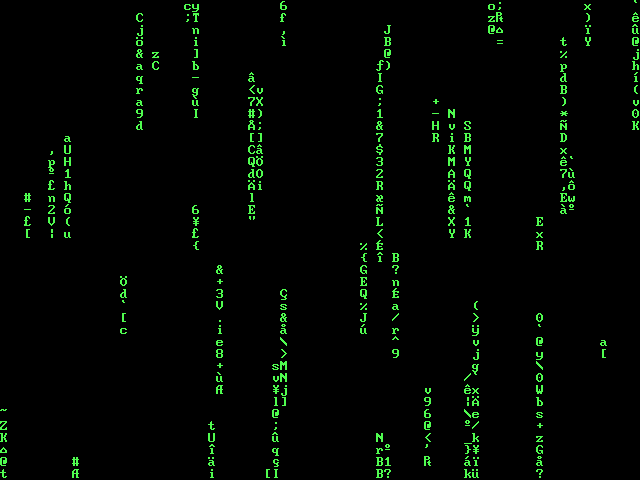

# Zeal Matrix

A matrix style "screensaver" for Zeal 8-bit Computer.



This was inspired by, and heavily based on the [Making the Matrix Screensaver in C on a PDP-11/83](https://www.youtube.com/watch?v=-foAV_zU2as) by [Dave's Garage](https://www.youtube.com/@DavesGarage/videos) on YouTube.

I copied the [original source](https://github.com/davepl/pdpsrc/blob/main/bsd/screensavers/matrix.c) from Dave's [pdpsrc](https://github.com/davepl/pdpsrc) repo, and removed all the ANSI Escape codes, and tweaked things until it made sense for the Zeal 8-bit platform.

## Controls

None - reset your hardware to exit

## Compiling

```bash
make -f sdcc.mk
```